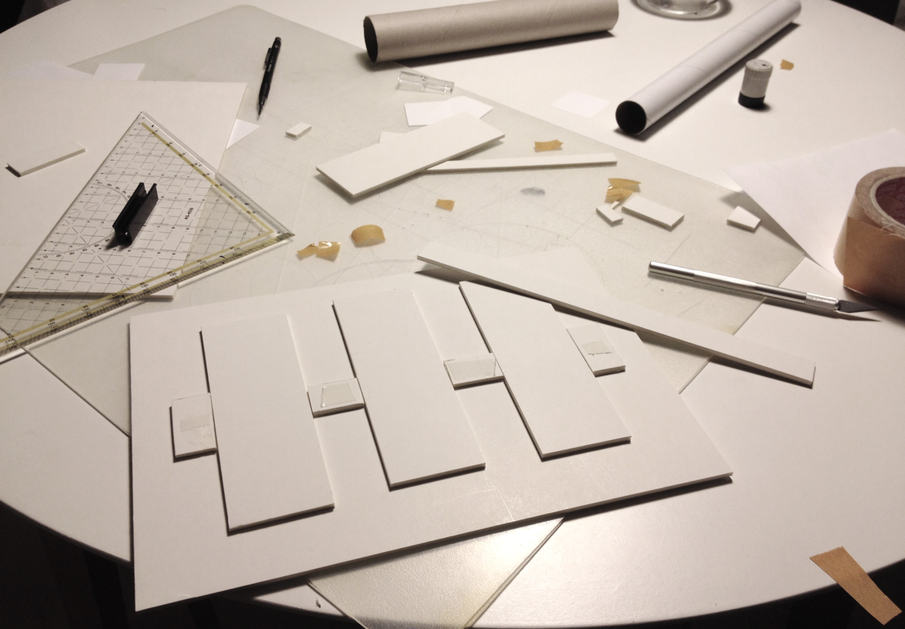
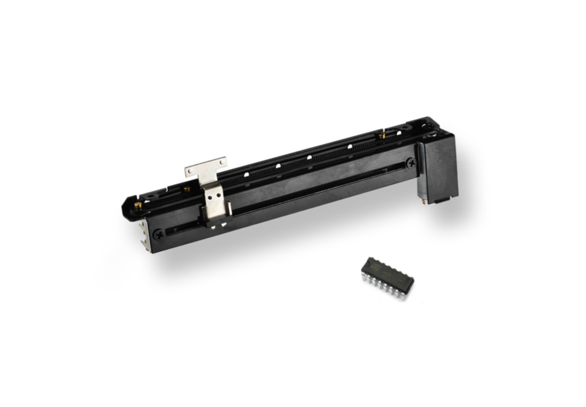
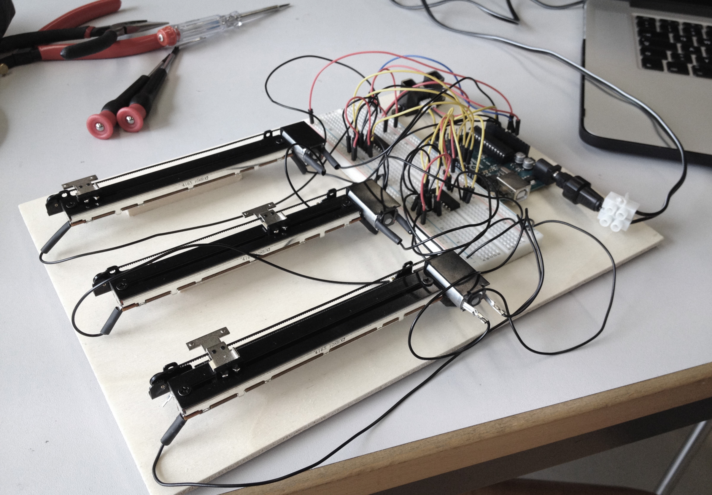
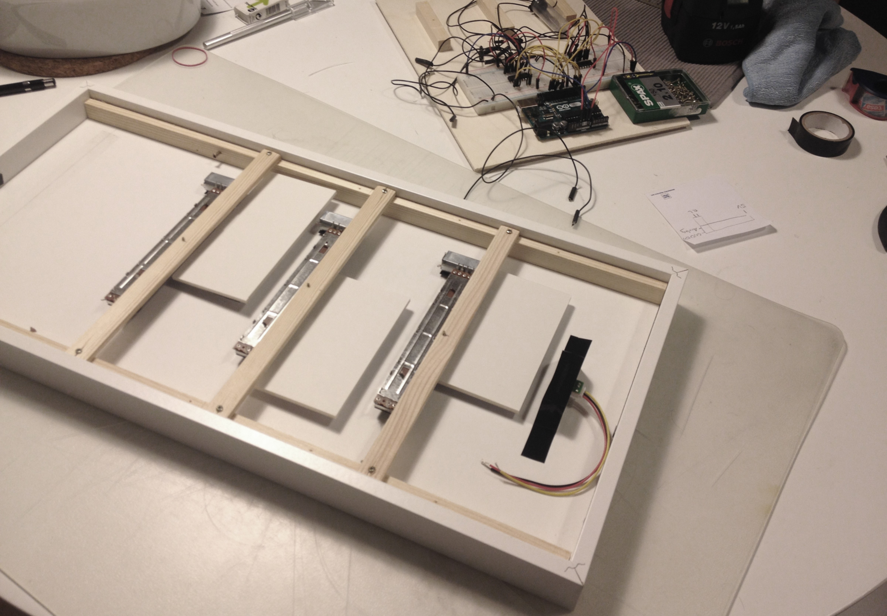
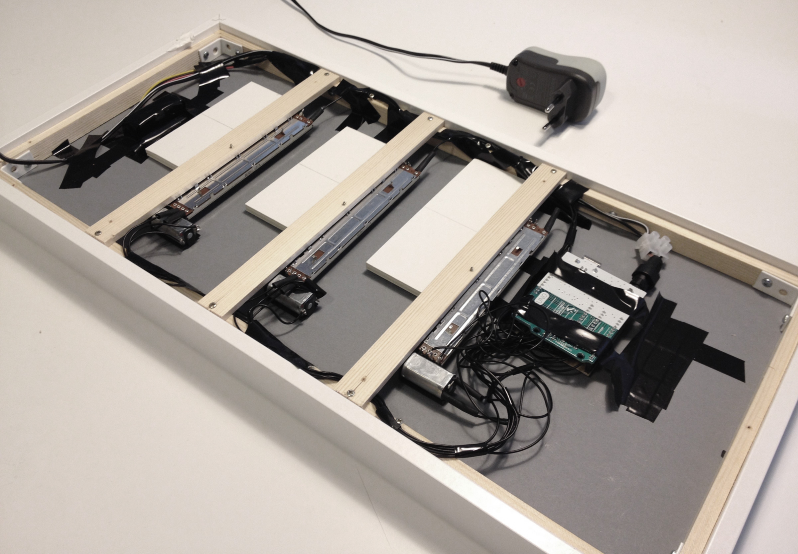
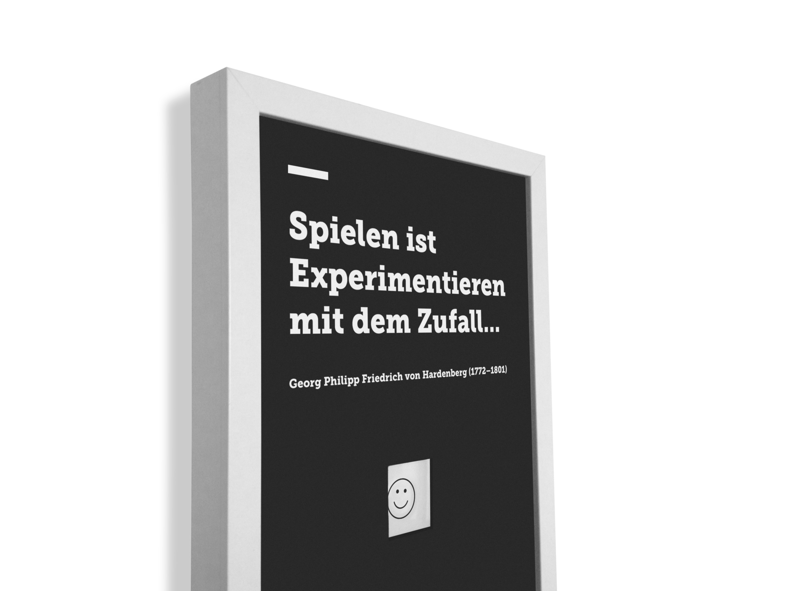

# Project Motor Poster

***The project started with a 2-day workshop in the field of physical computing. There I got a deeper insight about the scope of physical computing, which were illustrated with realized projects. Then I tried my first Circuits and first lines of code with the Arduino Uno.***

## Exercise

The task of the project was to create a motorized Poster or object. It was possible that only the pure passive presence of the observer serves as input and thus triggers the output.

## The idea

In a relatively short time I decided upon a project idea in order to have enough time for the implementation, because I could not estimate the complexity of such a project then.

I decided to create a game in which the viewer passively triggers the game and has a 50:50 chance of winning. Two sliders, with two different icons move back and forth for a short moment. Then they stop randomly and it is checked whether a match exists or not. A third slider shows the result.
Subsequently, the project idea should be put in a simple video-prototype.

[Visit Vimeo to see the prototype!](https://vimeo.com/140432923)  
pw: prototype

## Implementation

Quickly I began to think about what kind of components I needed, in order to realize the project. Right from the beginning, it was important to me that the mechanism is functioning properly and that I create an object that is actually looking good.

Due to my personal relation with music studio technology, I quickly came up with the idea to use motorized faders, which are used in studio consoles. To describe the function of a fader in more detail, you have to imagine that it is basically a potentiometer and a DC motor in one. Thus, with the potentiometer you get the possibility to determine exactly where the position of the fader is. Therefore, I was able to define the positions the faders should move to and at the same time, I could determine the speed. However, dc-motors can just rotate in one direction, so I had to use an H-Bridge, which controls the flow of electricity.

Following all the components I used:

1x Arduino Uno  
3x Slide Pot – Motorized  
2x H-Bridge L293D  
1x Sharp GP2Y0A02YK0F Infrarot Näherungssensor  
1x Netzteil für Arduino  
Kupferdraht und Steckschuhe  
Bilderrahmen Ribba (Ikea)  
Kapa-Platte

For the first tests, I built a pre-prototype so that I was able to work faster and to transport it easier.

I realized quickly that the project would be more complex as I have thought at the beginning. As it turned out, the correct wiring of the individual components represented itself as especially time-consuming.
As to that, here you can see a Fritzing Sketch:

Equally challenging was the programing of the code. For example, although the faders moved at the beginning back and forth, they did not do so as accurate as I’d desired. After the queries for the match and the order of the program were programmed, another conflict arose: Namely with the use of "Delays" that stopped the entire process. So I had to fall back on the possibilities through "Millis", which allows a parallel sequence of functions.

These are some pictures of the process:

## Final result

### Wie der Zufall so will
**As chance would have it**

The quote "To play is to experiment with chance" by Georg Philipp Friedrich von Hardenberg (1772-1801), reflects not only the basic principle of the game but also my approach to the project and the final result.

---

### [Visit Vimeo to see final video!](https://vimeo.com/140699908)

---

This project was created at the University of Applied Sciences Potsdam  
Course: Input/Output  
Semester: 2015

## License

The MIT License (MIT)

Copyright (c) 2015 Christopher Klement

Permission is hereby granted, free of charge, to any person obtaining a copy
of this software and associated documentation files (the "Software"), to deal
in the Software without restriction, including without limitation the rights
to use, copy, modify, merge, publish, distribute, sublicense, and/or sell
copies of the Software, and to permit persons to whom the Software is
furnished to do so, subject to the following conditions:

The above copyright notice and this permission notice shall be included in all
copies or substantial portions of the Software.

THE SOFTWARE IS PROVIDED "AS IS", WITHOUT WARRANTY OF ANY KIND, EXPRESS OR
IMPLIED, INCLUDING BUT NOT LIMITED TO THE WARRANTIES OF MERCHANTABILITY,
FITNESS FOR A PARTICULAR PURPOSE AND NONINFRINGEMENT. IN NO EVENT SHALL THE
AUTHORS OR COPYRIGHT HOLDERS BE LIABLE FOR ANY CLAIM, DAMAGES OR OTHER
LIABILITY, WHETHER IN AN ACTION OF CONTRACT, TORT OR OTHERWISE, ARISING FROM,
OUT OF OR IN CONNECTION WITH THE SOFTWARE OR THE USE OR OTHER DEALINGS IN THE
SOFTWARE.
